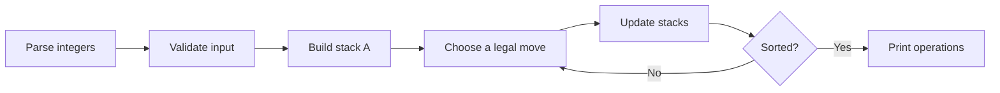
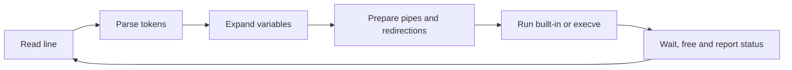
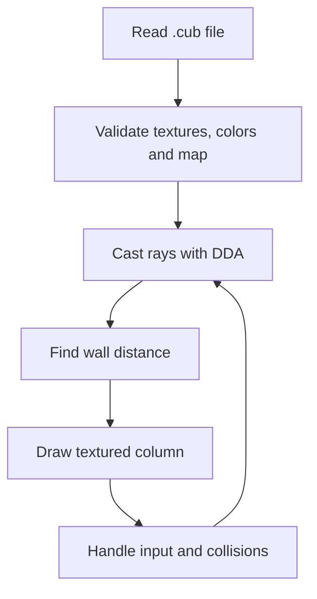

# 42 Abu Dhabi Project Learning Guide — Rank 00 through Rank 04

This guide explains the main idea behind each project in simple language. It is written for students who want to understand the learning path, not copy a solution. Always follow your school's rules and keep original authorship and licenses visible.

## How to use this guide

For each project:

1. Read the goal in one sentence.
2. Draw the data flow before writing code.
3. Build the smallest working version.
4. Add edge-case tests.
5. Run memory, error and style checks.
6. Write down one design decision and one lesson.

## Rank 00 — Libft

### What it does

Libft is a reusable C library that recreates common libc helpers and adds linked-list utilities.

### Main concepts

Pointers, arrays, strings, allocation, linked lists, static libraries, headers and Makefiles.

### How the code works

Each function has one small responsibility. A header exposes the public API, source files implement the functions, and `ar` packages object files into `libft.a`.

### How to run

```bash
make
make clean
make fclean
```

Link `libft.a` into another C program with `-L. -lft`.

### Common mistakes

Returning a pointer to freed memory, forgetting space for `\\0`, overflowing sizes, and leaking partially allocated arrays.

### What I learned

Small, well-tested functions are easier to reuse and debug than one large implementation.

## Rank 01 — ft_printf

### What it does

ft_printf formats values and writes them to standard output using a printf-like format string.

### Main concepts

Variadic arguments, format parsing, integer bases, pointers, return values and output buffering.

### How the code works

Scan the format string from left to right. Normal characters are written directly; a `%` conversion selects a typed formatting function.

### How to run

Build the library with `make`, then link `libftprintf.a` into a small test program.

### Common mistakes

Reading a variadic value with the wrong type, mishandling negative numbers, and returning the wrong character count.

### What I learned

An interface can stay simple while its internal parser handles many carefully defined cases.

## Rank 01 — Get Next Line

### What it does

Get Next Line returns one complete line per call from a file descriptor.

### Main concepts

File descriptors, `read`, static storage, partial reads, buffer sizes, EOF and ownership.

### How the code works

Keep unread bytes between calls, read more when a newline is missing, split at the first newline, and preserve the remainder for the next call.

### How to run

Compile the source with a small program that opens a file and calls `get_next_line(fd)` until it returns `NULL`.

### Common mistakes

Sharing state between file descriptors, losing the final line without a newline, and leaking the saved remainder on errors.

### What I learned

Stateful I/O is mostly about defining who owns each byte at every step.

## Rank 01 — Born2beroot

### What it does

Born2beroot configures a hardened Linux virtual machine.

### Main concepts

Users and groups, SSH, passwords, sudo, firewall rules, partitions, monitoring and documentation.

### How the code works

This is an administration project: configure one security control at a time, verify it, then document the result.

### How to run

Complete the work inside a disposable VM. Never test security changes on a production machine.

### Common mistakes

Locking yourself out of SSH, using weak passwords, forgetting least privilege, and failing to record configuration changes.

### What I learned

Reliable software also depends on secure, observable operating environments.

## Rank 02 — Push_swap

### What it does

Push_swap prints a short sequence of legal operations that sorts integers held in two stacks.

### Main concepts

Linked structures, validation, rotations, cost analysis, small-set strategies and instruction counting.

### How the code works

Validate input, build stack A, move values between stacks using legal operations, and stop only when A is sorted and B is empty.



### How to run

```bash
make
./push_swap 4 2 1 3
```

### Common mistakes

Accepting duplicates, breaking links during `push`, printing false operations, and optimizing before the basic operations work.

### What I learned

Algorithm quality can be measured with data: correctness tests plus operation counts.

## Rank 02 — Minitalk

### What it does

Minitalk sends a message from one process to another using Unix signals.

### Main concepts

Processes, PIDs, `SIGUSR1`, `SIGUSR2`, bit encoding, acknowledgements and synchronization.

### How the code works

The client sends one bit at a time; the server rebuilds each byte and acknowledges progress so the sender does not outrun the receiver.

### How to run

```bash
make
./server
./client <server-pid> "hello"
```

### Common mistakes

Ignoring signal timing, using unsafe handler operations, losing the last byte, and forgetting to validate the PID.

### What I learned

Very small communication channels require explicit protocols and confirmation.

## Rank 02 — fract-ol

### What it does

fract-ol renders interactive Mandelbrot and Julia fractals.

### Main concepts

Complex numbers, iteration limits, pixel mapping, MiniLibX events, zoom and color palettes.

### How the code works

Map each pixel to a complex coordinate, iterate the selected formula, convert the escape count into a color, then redraw after input events.

### How to run

```bash
make
./fractol mandelbrot
./fractol julia -0.8 0.156
```

### Common mistakes

Mixing screen and world coordinates, dividing by zero, leaking images, and redrawing without handling window-close events.

### What I learned

Math becomes tangible when a clean model is connected to an event-driven interface.

## Rank 03 — Minishell

Minishell is documented in the [dedicated guide](https://github.com/fatma726/minishell-42). It teaches parsing, expansion, pipes, redirections, heredocs, signals, processes and cleanup.



## Rank 03 — Philosophers

### What it does

Philosophers simulates workers competing for shared resources while trying to avoid starvation and deadlock.

### Main concepts

POSIX threads, mutexes, timing, race conditions, fairness and coordinated shutdown.

### How the code works

Create one thread per philosopher, protect each fork with a mutex, record the last meal time, and let a monitor stop the simulation when a philosopher dies or everyone finishes.

### How to run

```bash
make
./philo 5 800 200 200
```

### Common mistakes

Locking forks in the same order for every thread, checking time without protection, sleeping too inaccurately, and forgetting to destroy mutexes.

### What I learned

Concurrency bugs are about timing and ownership, not just syntax.

## Rank 04 — Cub3D

### What it does

Cub3D builds a small ray-casting game engine from a text map.

### Main concepts

Parsing, map validation, DDA ray casting, textures, movement, collision and MiniLibX rendering.

### How the code works

Parse configuration and the map, cast one ray per screen column, walk the map grid with DDA until a wall is hit, calculate wall height, draw the column, then process movement and collisions.



### How to run

Use a valid `.cub` map with the project's Makefile, then launch the executable with the map path, for example `./cub3D maps/example.cub`.

### Common mistakes

Allowing open maps, mixing degrees and radians, using the wrong fish-eye distance, and freeing textures after the window closes instead of before.

### What I learned

A reliable parser and coordinate model are the foundation of a convincing real-time display.

## Rank 04 — NetPractice

### What it does

NetPractice solves small IPv4 addressing and routing exercises.

### Main concepts

Binary masks, network and broadcast addresses, host ranges, gateways and routing tables.

### How the code works

Convert addresses to binary, apply the mask, identify the network, then verify that each host and gateway belongs to the expected subnet.

### How to run

Complete the exercises in the provided browser-based training interface and record the reasoning for each answer.

### Common mistakes

Confusing a host address with a network address, assigning a gateway outside the subnet, and forgetting that the network and broadcast addresses are reserved.

### What I learned

Networking becomes manageable when every address is checked against a precise rule.

## Rank 04 — C++ Modules 00–04

### What it does

The modules introduce object-oriented programming in C++98 through small, focused exercises.

### Main concepts

Classes, constructors, destructors, canonical form, deep copies, operator overloading, inheritance, polymorphism and abstract interfaces.

### How the code works

Start with a class that protects its invariants, add ownership-safe copying, then extend behavior through inheritance and virtual interfaces without losing the base contract.

### How to run

Each module has its own Makefile. Build from that module directory and run its executable or tests.

### Common mistakes

Shallow-copying owned memory, forgetting virtual destructors, exposing mutable state, and relying on newer language features when the task requires C++98.

### What I learned

Good interfaces make ownership, extension and substitution explicit.

## Final checklist for students

- Can you explain the data structure before explaining the code?
- Can you name the ownership rule for every allocation?
- Can you reproduce the failure with a small test?
- Can you describe what happens on invalid input?
- Can another student build the project from your README?
- Did you preserve licenses and credit collaborators?
